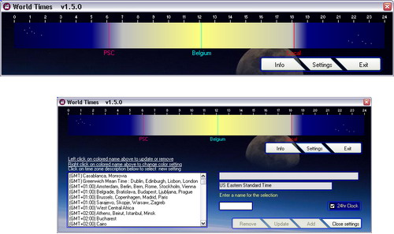



## World\_Times

### Description

Never again wake up your friends at an inappropriate moment. World Times shows the time of any part of the world on a graphical time bar, and does so by taking into account the daylight savings of each particular zone. The local time (i.e. the time setting of your PC) is always shown, and you can select up to 4 other time zones to be displayed. Plenty of other features. Well commented code. Info form, credits. My end of year gift for all of you. 73 KB (Paul Turcksin)
 
### More Info
 

             |
---                |---
**Submitted On**   |2005-12-29 18:03:02
**By**             |[Paul Turcksin](https://github.com/Planet-Source-Code/PSCIndex/blob/master/ByAuthor/paul-turcksin.md)
**Level**          |Intermediate
**User Rating**    |5.0 (75 globes from 15 users)
**Compatibility**  |VB 6\.0
**Category**       |[Complete Applications](https://github.com/Planet-Source-Code/PSCIndex/blob/master/ByCategory/complete-applications__1-27.md)
**World**          |[Visual Basic](https://github.com/Planet-Source-Code/PSCIndex/blob/master/ByWorld/visual-basic.md)
**Archive File**   |[World\_Time19606112302005\.zip](https://github.com/Planet-Source-Code/paul-turcksin-world-times__1-63842/archive/master.zip)

